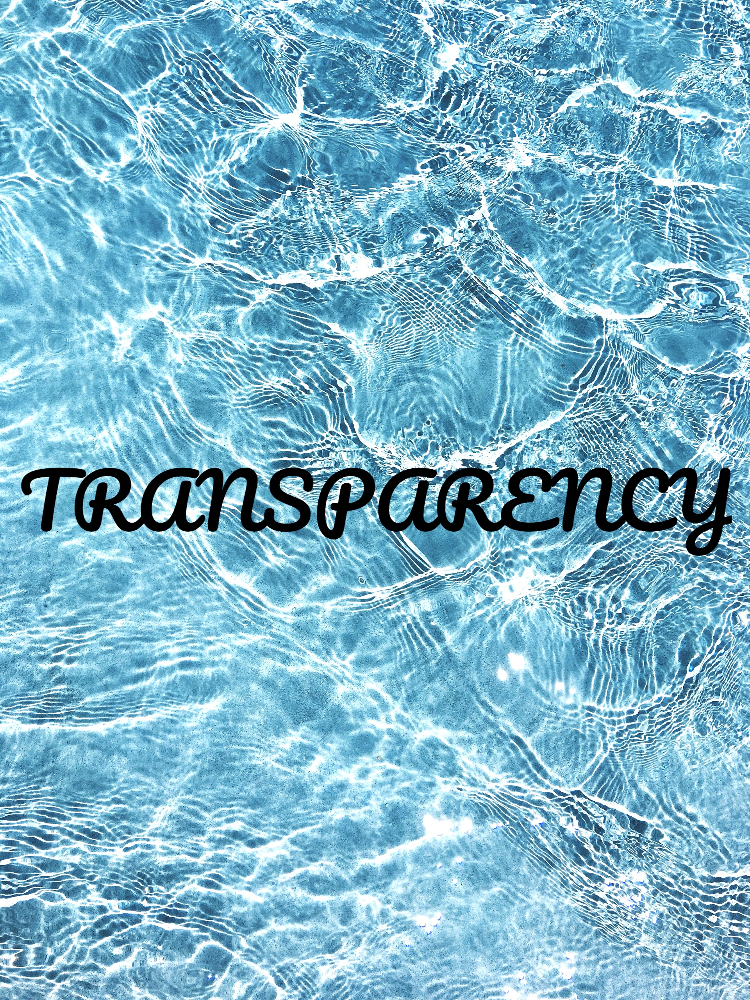

##  {background-image="../img/ux-indonesia-qC2n6RQU4Vw-unsplash.jpg"}

::: r-fit-text
**Research**
:::

[Photo by <a href="https://unsplash.com/@uxindo?utm_source=unsplash&utm_medium=referral&utm_content=creditCopyText">UX Indonesia</a> on <a href="https://unsplash.com/photos/person-writing-on-white-paper-qC2n6RQU4Vw?utm_source=unsplash&utm_medium=referral&utm_content=creditCopyText">Unsplash</a>]{style="font-size: 8px;"}

##  {background-image="../img/alex-shute-bGOemOApXo4-unsplash.jpg"}

[Photo by <a href="https://unsplash.com/@faithgiant?utm_source=unsplash&utm_medium=referral&utm_content=creditCopyText">Alex Shute</a> on <a href="https://unsplash.com/photos/a-wooden-block-that-says-trust-surrounded-by-blue-flowers-bGOemOApXo4?utm_source=unsplash&utm_medium=referral&utm_content=creditCopyText">Unsplash</a>]{style="font-size: 8px;"}

## 

:::::::: columns
::: {.column width="40%"}
{width="350" fig-align="right"}

[Photo by <a href="https://unsplash.com/@helloimnik?utm_source=unsplash&utm_medium=referral&utm_content=creditCopyText">Nik</a> on <a href="https://unsplash.com/photos/red-text-on-black-background-0urrnqA66Lo?utm_source=unsplash&utm_medium=referral&utm_content=creditCopyText">Unsplash</a>]{style="font-size: 8px;"}
:::

:::::: {.column width="60%"}
::: r-fit-text
"A crisis of **confidence**?" @pashler2012
:::

  

::: {.fragment .r-fit-text style="text-align: center;"}
**Research crises**
:::

 

::: {.fragment .r-fit-text}
Part of the **polycrisis** @morin1999[; @tooze2023]{.small-ref}.
:::
::::::
::::::::

## Research reliability

.](/img/reproducible-matrix-d15700202901e2e2e85fd2dcc71a158b.jpg){fig-align="center"}

## Research reliability

{fig-align="center"}

##  {.center background-image="../img/dusan-veverkolog-mX2mdxhc0UM-unsplash.jpg"}

::: {.r-fit-text style="color: white;"}
**SOUND**
:::

[Photo by <a href="https://unsplash.com/@veverkolog?utm_source=unsplash&utm_medium=referral&utm_content=creditCopyText">Dušan veverkolog</a> on <a href="https://unsplash.com/photos/gray-stacked-stones-photo-mX2mdxhc0UM?utm_source=unsplash&utm_medium=referral&utm_content=creditCopyText">Unsplash</a>]{style="font-size: 8px;"}

## Open Research

::::::::: columns
::::: {.column width="50%"}
::: callout-note
## What is it?

Open Research is a movement that stresses the importance of a **more honest and transparent research** by promoting a series of research principles and by warning about common, although not necessarily intentional, questionable practices and misconceptions.

@munafo2017[, @cruwell2019, @casillas2025]{.small-ref}
:::

::: {.callout-important .fragment}
## How to make your research open?

- Share **Research compendia**.

- Write **Registered Reports**.

- Reflect on your **researcher's orientation**.
:::
:::::

::::: {.column width="50%"}
:::: fragment
{height="450px" fig-align="center"}

::: {style="text-align: left;"}
[Photo by <a href="https://unsplash.com/@noahusry?utm_source=unsplash&utm_medium=referral&utm_content=creditCopyText">Noah Usry</a> on <a href="https://unsplash.com/photos/water-ripple-digital-wallpaper-cojUQF-9GT0?utm_source=unsplash&utm_medium=referral&utm_content=creditCopyText">Unsplash</a>]{style="font-size: 8px;"}
:::
::::
:::::
:::::::::

## Research compendium

> A **research compendium** accompanies, enhances, or is a scientific publication providing data, code, and documentation for reproducing a scientific workflow.

—[Research compendium](https://research-compendium.science)

. . .

> A **research compendium** is a collection of all digital parts of a research project including data, code, texts (protocols, reports, questionnaires, meta data).
> The collection is created in such a way that reproducing all results is straightforward.

—[The Turing Way: Research compendia](https://the-turing-way.netlify.app/reproducible-research/compendia.html)

## Research compendium

::: callout-note
## Research Compendium

A **research compendium** is a repository containing all materials, code, notebooks, images, data, metadata, manuscripts, etc of a project.
A compendium is structured in a way that makes the research process transparent and reproducible.
:::

. . .

::: {.callout-tip appearance="simple"}
- Ideally, use a **single main folder**.
- Organise files and folders inside according to **type and context**: separate data, code, images.
- Separate **raw and derived** data.
- Use as much **automation** as possible.
- **Document** everything (for example with `README`s).
:::

## Research compendium: bad example

{fig-align="center"}

## Research compendium: good example

{fig-align="center"}

## Sharing research compendia

[{fig-align="center"}](https://osf.io/w92me/overview)

## Licensing

::: callout-note
## Pick a license

- Creative Commons is a commonly chosen license: <https://creativecommons.org/chooser/>

- Other licenses (for software): MIT License, GNU license.

- Always include a `LICENSE` file in your compendium and be explicit which parts of the compendium fall under which license.
:::

## Registered Reports

{fig-align="center"}

## Registered Reports

{fig-align="center"}

## Registered Reports: positive results

{fig-align="center" width="533"}

## Registered Reports: not killing the vibe

{fig-align="center"}

## Registered Reports: resources

::: {.callout-note appearance="simple"}
- @chambers2021: tips on writing RRs.

- @karhulahti2022; @karhulahti2023 for qualitative research.

- PCI RR <https://rr.peercommunityin.org>: examples of Stage 1 and Stage 2 manuscripts.

- Registered Reports in Linguistics: <https://journals.ed.ac.uk/rrling/index>.
:::

##  {.center background-image="../img/dimmis-vart-jaIx3CaUKHE-unsplash.jpg"}

::: r-fit-text
**Research is not done in a vacuum. Knowledge is contextual.**
:::

[Photo by <a href="https://unsplash.com/@dimmisvart?utm_source=unsplash&utm_medium=referral&utm_content=creditCopyText">Dimmis Vart</a> on <a href="https://unsplash.com/photos/white-concrete-building-with-white-walls-jaIx3CaUKHE?utm_source=unsplash&utm_medium=referral&utm_content=creditCopyText">Unsplash</a>]{style="font-size: 8px;"}

## Researcher's orientation

::: {.callout-note appearance="simple"}
- **Reflexive** understanding of one's own individual aspects and how they shape one's own approach to and practice of research.

- Not limited to: identity, lived experiences, social positionality, philosophical stance, personal beliefs, methodological theory, and more.
:::

## Researcher's orientation: resources

::: {.callout-note appearance="simple"}
- Positionality

  - @darwinholmes2020, @goundar2025 for qualitative research.

  - @jafar2018, @lazard2020 for quantitative research.

- Philosophical stance

  - @okasha2016, @rosenberg2020

  - @tomlinson2023, @castanelli2024 for PhD/ECRs.
:::

## Summary

::: callout-note
### Open Research

- Transparency and reliability of results (reproducible, replicable, robust, generalisable).

- Curate and share research compendia (with license).

- Publish Registered Reports.

- Think about your researcher's orientation.
:::

## References
